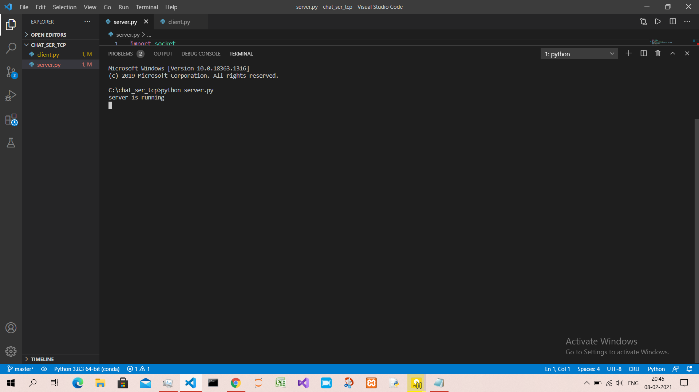
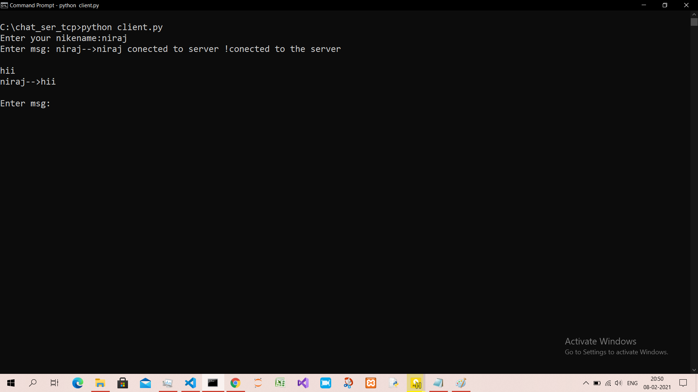

# chat_server_TCP
I developed a chat server and client program using python, that uses TCP protocol.
The **client** program and **server** program provides a **CLI** interface, to interact with user.  
**Server Interface**  

**Client Interface**  

